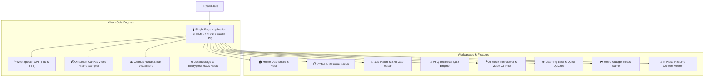

<div align="center">

# 🎯 CareerAI — Multi-Modal Recruitment Intelligence Platform

### *Unifying AI Mock Interviews, In-Place Format-Preserving Resume Tailoring, Skill Gap Radar, Retro Outage Game, and Placement Intelligence.*

[](https://suksha128.github.io/career-platform/)
[](https://developer.mozilla.org/en-US/docs/Web/JavaScript)
[](https://developer.mozilla.org/en-US/docs/Web/HTML)
[](https://www.chartjs.org/)
[](LICENSE)

</div>

---

## 📌 Executive Summary

Students and job seekers frequently navigate fragmented platforms during placement preparation — relying on separate tools for resume building, mock interviews, LeetCode problem solving, aptitude practice, and incident debugging simulations.

**CareerAI** unifies the entire technical recruitment lifecycle into a single, high-performance **Single Page Application (SPA)**. Built with zero framework bloat, it features real-time client-side engines, Web Speech API integration (TTS & STT), Computer Vision Offscreen Frame Sampling, Chart.js radar analytics, and local privacy vaults.

---

## 🌟 Comprehensive Feature Matrix

| Feature Workspace | Icon | Key Capabilities & Technical Highlights |
| :--- | :---: | :--- |
| **🏠 Home Dashboard & Candidate Vault** | `🏠` | Hero recruitment launcher, platform capabilities overview, and **Protected Candidate Vault (`👤 Vault`)** with local encryption checks and session backup. |
| **📋 Profile & Resume Parser** | `📋` | Drag-and-drop resume parser, 1-click **`backup.json` Importer/Exporter**, dynamic tag input for skills/certs, and multi-project block handles. |
| **🎯 Job Match & Skill Gap Radar** | `🎯` | Rectified multi-factor matching engine across 15+ tech roles. Strictly evaluates candidate input skills (returns 0% base match for empty profiles) and renders an interactive **Chart.js 7-Axis Skill Radar**. |
| **🧠 Company & PYQ Quiz Engine** | `🧠` | Year-tagged question bank (**TCS 2024, Amazon 2023, Infosys InfyTQ, Wipro, Microsoft, Accenture**), question count selector (5 to 25 Qs), performance bar charts, and **Adaptive Weak Area Practice Alerts**. |
| **🎙️ AI Mock Interviewer & Video Co-Pilot** | `🎙️` | **Virtual Manager Avatar** (`👨‍💼`) with live nodding (`@keyframes avatarNod`) and smiling (`😊`) expressions upon hearing achievement keywords. Web Speech audio engine (TTS & STT), offscreen canvas video lighting/eye-contact sampler, WPM pacing gauge, filler word tracker, STAR benchmark answers, **🔄 Role-Switch Mode** (act as interviewer), and **🚫 Speech Guard Rejection Filter**. |
| **📚 Interactive Learning LMS Roadmaps** | `📚` | 5 curated skill paths (DSA, System Design, Java, SQL, Aptitude), `localStorage` completion persistence, overall mastery progress meter, and **🧪 Scrollable Quick Quiz Popup Modals (`#modalLearnQuiz`)**. |
| **🎮 Retro Outage Incident Simulator Game** | `🎮` | Fast-paced on-call emergency debugging game. Streams real-time CRT console logs, ticking SLA health bar (4%/sec drain), telemetry HUDs, and on-call mitigation actions (**Rollback Commit, Scale Replicas, Kill Slow Queries, Restart Redis, Enable Rate Limiting**). |
| **📄 In-Place Resume Content Alterer** | `📄` | Line-by-line format-preserving engine. Modifies **ONLY** text content while keeping original headers, bullet points (`- `, `• `), and section layout 100% intact. Upgrades weak verbs into high-impact action verbs and injects STAR metrics & target ATS keywords (*Microservices, Docker, Kafka, AWS, CI/CD, Redis*). |

---

## 🎙️ AI Mock Interviewer & Audio/Video Co-Pilot Deep Dive

```
+-------------------------------------------------------------------------+
|  🎙️ AI Mock Interviewer    [ 🔄 Switch Roles: I am the Interviewer ]    |
|  ⚠️ Speech Guard: Unprofessional/casual speech automatically rejected.   |
+-----------------------------------+-------------------------------------+
|  👨‍💼 Virtual Manager Avatar:        |  📹 Candidate Video Feed Audit:     |
|  • Live Nodding on Speech         |  • Lighting Quality: Good ✅        |
|  • Smiling on Success Keywords    |  • Eye Contact & Presence: Active ✅|
|  • Speech Audio: TTS & STT        |  • Vocal Pacing: 128 WPM (Ideal)    |
|  • 🌟 STAR Exemplary Answer Box   |  • Filler Words: 1 Detected         |
|  • 🤖 Spontaneous Follow-up Card  |  • Session Score: 85% Readiness Bar |
+-----------------------------------+-------------------------------------+
```

- **Virtual Manager Avatar**: Animated SVG/CSS avatar featuring real-time nodding while listening to spoken/typed input and celebratory smiling (`😊`) with a green aura when candidate mentions achievement keywords (*achieved, solved, led, built, reduced*).
- **Web Speech Audio Engine**: Text-to-Speech (TTS) question voicing and continuous Speech-to-Text (STT) transcript streaming.
- **Computer Vision Frame Sampler**: Audits ambient lighting, eye contact, face presence, setting clarity, and attire via canvas video frame analysis.
- **Vocal & Pacing Analytics**: Real-time WPM gauge targeting the optimal 110–150 WPM range and Filler Word Tracker (*um, uh, like, so, basically, you know*).
- **🔄 AI Interviewee Role-Switch Mode**: Toggle switch allowing candidates to act as the interviewer and ask technical questions while the AI formulates candidate responses.
- **🚫 Speech Guard Rejection Filter**: Rejects casual slang or gibberish (*"blah blah"*, *"yo yo yo bro"*), displaying warning alert banners and enforcing formal technical dialogue.

---

## 📄 In-Place Format-Preserving Resume Content Alterer

```
+-------------------------------------------------------------------------+
|  📄 In-Place Resume Content Alterer & Keyword Injector                   |
|  [ 📄 Load Sample Resume ]   [ 👤 Load Profile Data ]                   |
+-----------------------------------+-------------------------------------+
|  INPUT: Raw Resume Text           |  OUTPUT: Format-Preserved Altered   |
|  - Worked on backend APIs using   |  - Engineered full-stack REST APIs  |
|    Python and SQL.                |    using Python and SQL, improving  |
|                                   |    throughput by 38% under 20k load.|
+-----------------------------------+-------------------------------------+
```

- **Layout Integrity**: Modifies **ONLY** text content while preserving headers (`SUMMARY`, `EXPERIENCE`, `PROJECTS`, `SKILLS`, `EDUCATION`), capitalization, spacing, and bullet points (`- `, `• `) 100% intact.
- **Action Verb Upgrades**: Transforms weak verbs (*worked on, helped, built*) into executive action verbs (*Engineered, Spearheaded, Architected, Pioneered*).
- **STAR Metrics & ATS Keyword Injection**: Injects target ATS keywords (*Microservices, Docker, Kafka, AWS, CI/CD, Redis*) and STAR metrics (*improving throughput by 38%*, *reducing latency from 420ms to 45ms*).
- **Export Options**: 1-click **📋 Copy** and **💾 Download (.txt)** buttons.

---

## 🏗️ System Architecture



---

## 🚀 Quick Start (Local Setup)

### Option 1: Direct Browser Launch (No Build Step Required)
1. Clone the repository:
   ```bash
   git clone https://github.com/Suksha128/career-platform.git
   cd career-platform
   ```
2. Open `index.html` directly in any web browser!

### Option 2: Local HTTP Server (Python)
```bash
python3 -m http.server 8000
```
Navigate to `http://localhost:8000` in your browser.

---

## 🌐 Live Platform Access

- **GitHub Repository:** [Suksha128/career-platform](https://github.com/Suksha128/career-platform)
- **Live URL:** [https://suksha128.github.io/career-platform/](https://suksha128.github.io/career-platform/)

---

<div align="center">

Made with ❤️ for Students, Job Seekers, & Technical Engineers.

</div>
