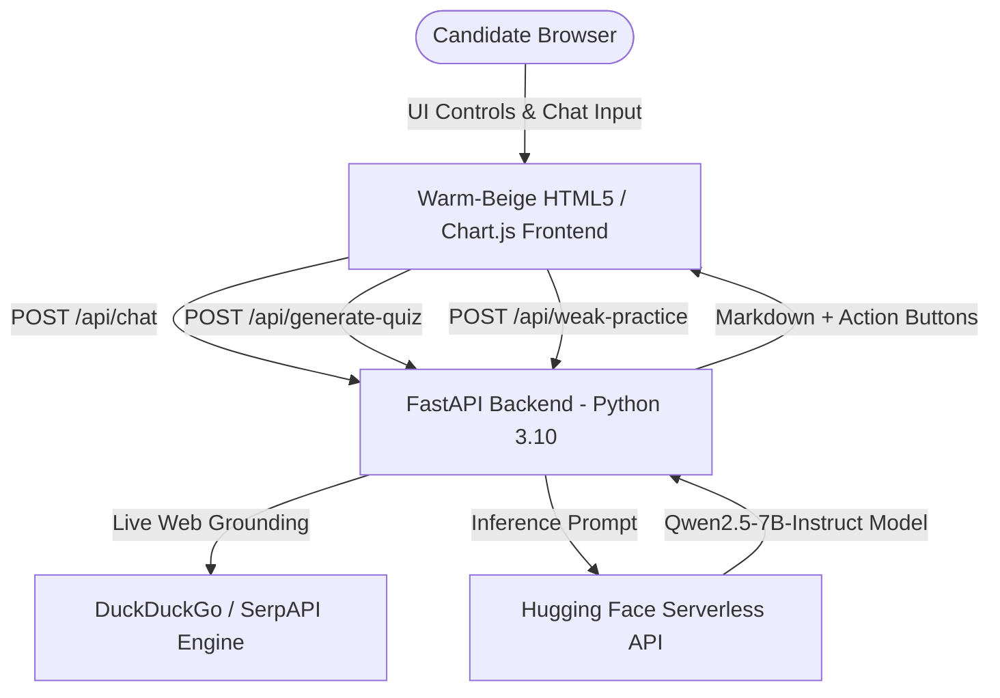

<div align="center">

# 🎯 CareerAI — AI-Powered Campus Placement Platform

### *Unifying Student Skill Matching, ATS Resume Optimization, Company-Tagged PYQs, and Live Recruitment Intelligence.*

[](https://python.org)
[](https://fastapi.tiangolo.com)
[](https://huggingface.co/Qwen/Qwen2.5-7B-Instruct)
[](#-ui--design-aesthetic)
[](LICENSE)

</div>

---

## 📌 Executive Summary

Students frequently navigate multiple fragmented platforms to prepare for placements — using one website for aptitude, another for coding, YouTube for technical learning, separate forums for company previous year questions (PYQs), and external tools for resume formatting.

**CareerAI** unifies the entire student placement lifecycle into a single, AI-driven platform. It parses candidate resumes, evaluates domain-filtered job matches, tailors resumes to target roles using the **Google XYZ formula**, generates company & year-tagged interview quizzes with **adaptive weak-area targeting**, and powers a live **Recruitment Intelligence Assistant** with direct application links.

---

## 🌟 Key Features & Highlights

| Feature Module | Description & Capabilities |
| :--- | :--- |
| **📄 Profile Builder & Parsing** | Automatic extraction of skills, experience, and project credentials from uploaded PDF/Doc resumes into structured candidate profiles. |
| **🎯 Role Match & Skill Gap Radar** | Domain-filtered vector analysis (SDE, AI/ML, Frontend, Backend, DevOps, Data) with interactive **Chart.js radar graphics** comparing candidate skill levels vs. market requirements. |
| **⚡ 1-Click ATS Resume AI Tailor** | Live ATS score jump meter (e.g., 54 → 87 ATS Score), Google XYZ impact formula transformations, and automated keyword injection for top companies. |
| **🧠 Company & Year-Tagged Quiz Engine** | Verified PYQ question bank (TCS NQT 2024, Amazon 2023, Infosys InfyTQ, Wipro, Microsoft, Accenture), custom question length selector (**5 to 15 Qs**), and **Adaptive Weak Area Practice Alerts** (auto-detects accuracy drop < 60% and triggers 5+ targeted practice Qs). |
| **📚 Curated Free Learning Roadmaps** | Skill gap aligned learning paths referencing 100% free open-source resources (YouTube playlists, GitHub repositories, LeetCode Top 150, GeeksforGeeks). |
| **💬 Live Recruitment Intelligence Assistant** | Powered by **Qwen2.5-7B-Instruct** + live search grounding. Answers hiring statuses, deadlines, and automatically renders **Clickable Redirect Action Buttons** (`🔗 Apply Now ↗`) to registration portals. |

---

## 🎨 UI & Design Aesthetic

CareerAI shuns generic dark-mode "neon AI wrapper" tropes in favor of an **editorial, warm-beige, cream, and deep terracotta/maroon aesthetic** (inspired by Notion and Linear):

* **Background (`--bg`):** `#fdfcf9` (Warm Cream Off-White)
* **Primary Accent (`--p`):** `#8f3c30` (Earthy Terracotta Red / Clay Maroon)
* **Secondary Accent (`--p2`):** `#3a5f6f` (Muted Slate Blue)
* **Typography:** **Outfit** (Bold Headings) + **Inter** (Body & UI controls)
* **Transitions:** Smooth opacity fades (zero layout sliding/jumping)

---

## 🏗️ System Architecture



---

## 🚀 Quick Start (Local Setup)

### Option 1: One-Command Execution (Mac / Linux / WSL)

```bash
# 1. Clone your repository
git clone https://github.com/Suksha128/career-platform.git
cd career-platform

# 2. Run automated setup (creates virtualenv & installs requirements)
./setup.sh

# 3. Launch platform server & UI
./run.sh
```

### Option 2: 1-Click Launch inside VSCode
1. Open the project folder in VSCode:
   ```bash
   code .
   ```
2. Press **`F5`** to start debugging via the pre-configured `.vscode/launch.json`.
3. Or press **`Cmd + Shift + B`** (Mac) / **`Ctrl + Shift + B`** (Windows) to trigger the build runner task.

---

## 🌐 Deployment & Custom Domain Setup

### 1. GitHub Pages (Frontend Hosting)
* Go to **Repository Settings** → **Pages**.
* Select **Source:** `Deploy from a branch` → `main` → `/ (root)`.
* *(Custom Domain)* Scroll to **Custom domain**, enter `careers.yourdomain.com`, and add a `CNAME` record in your DNS pointing to `Suksha128.github.io.`.

### 2. Hugging Face Spaces / Docker (Continuous Agent Hosting)
* Create a **Docker Space** on Hugging Face.
* Add your `HF_API_TOKEN` under **Space Settings** → **Variables & Secrets**.
* Push the repository to the Space. Hugging Face automatically detects the `Dockerfile` and builds the space on port `7860`.

---

## 📁 Repository Structure

```text
career-platform/
├── .vscode/               # VSCode launch, tasks, and Python settings
│   ├── launch.json
│   ├── tasks.json
│   └── settings.json
├── backend/               # FastAPI Server & Python Agents
│   ├── app.py             # Main entry point (FastAPI + Qwen2.5 + Web Grounding)
│   └── data/
│       └── question_bank.json  # 220+ Verified PYQ Bank
├── public/
│   └── index.html         # Frontend source page
├── index.html             # Main Root Page for GitHub Pages & HF Spaces
├── Dockerfile             # Container definition for Hugging Face / Render
├── setup.sh               # Environment setup script
├── run.sh                 # Application start script
├── requirements.txt       # Python dependencies
├── .env.example           # Environment template
└── README.md              # Project documentation & HF Space metadata
```

---
Direct Link: https://suksha128.github.io/career-platform/
<div align="center">

Made with ❤️ for Students & Job Seekers.

</div>
